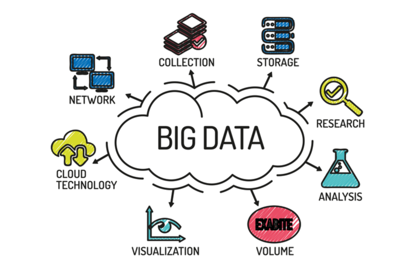

# Content
1. [What is big data?](big-data-note.md#Question-01)
2. [What are the 5's in Big Data](big-data-note.md#Question-02)
3. [How is Hadoop and Big Data related?](big-data-note.md#Question-03)
4. [Explain the importance of Hadoop technology in Big data analytics](big-data-note.md#Question-04)
5. [Define respective components of HDFS and YARN](big-data-note.md#Question-05)
6. [Why is Hadoop used for Big Data Analytics?](big-data-note.md#Question-06)
7. [What is fsck?](big-data-note.md#Question-07)

--------------

## Question-01
**QUE: what is big data?**  
Big Data refers to extensive and often complicated data sets so huge that they’re beyond the capacity of managing with conventional software tools. Big Data comprises unstructured and structured data sets such as videos, photos, audio, websites, and multimedia content.

**Businesses collect the data they need in countless ways, such as:**
1. Internet cookies
2. Email tracking
3. Smartphones
4. Smartwatches
5. Online purchase transaction forms
6. Website interactions
7. Transaction histories
8. Social media posts
9. Third-party trackers -companies that collect and sell clients and profitable data

**Working with big data involves three sets of activities:**   
**Integration**: This involves merging data often from different sources – and molding it into a form that can be analyzed in a way to provide insights.    
**Management**: Big data must be stored in a repository where it can be collected and readily reached. The largest amount of Big Data is unstructured, causing it ill-suited for conventional relational databases, which need data in tables-and-rows format.   
**Analysis**: The Big Data investment return is a spectrum of worthy market insights, including details on buying patterns and customer choices. These are represented by examining large data sets with tools driven by AI and machine learning.   

**Explain the importance of Hadoop technology in Big data analytics.**   
Since big data includes a large volume of data, i.e., structured, semi-structured, and unstructured data, analyzing and processing this data is quite a big task. There was a need for a tool or technology to help process the data at a rapid speed. Therefore, Hadoop is used because of its capabilities like storage, processing capability. Moreover, Hadoop is an open-source software. If you want to consider the cost, it’s beneficial for business solutions.

The main reason for its popularity in recent years is that this framework permits distributed processing of enormous data sets using crosswise clusters of computers practicing simple programming models.

## Question-02
**QUE: What are the 5's in Big Data**  

Big data is a collection of data from many different sources and is often described by 5 characteristics: volume, value, variety, velocity, and veracity.

Volume: the size and amounts of big data that companies manage and analyze.

Value: the most important “V” from the perspective of the business, the value of big data usually comes from insight discovery and pattern recognition that lead to more effective operations, stronger customer relationships and other clear and quantifiable business benefits.

Variety: the diversity and range of different data types, including unstructured data, semi-structured data and raw data.

Velocity: the speed at which companies receive, store and manage data – e.g., the specific number of social media posts or search queries received within a day, hour or other unit of time.

Veracity: the “truth” or accuracy of data and information assets, which often determines executive-level confidence

The additional characteristic of variability can also be considered:
Variability: the changing nature of the data companies seek to capture, manage and analyze – e.g., in sentiment or text analytics, changes in the meaning of key words or phrases.

## Question-03
**QUE: How is Hadoop and Big Data related**   
Hadoop is an open-source framework for saving, processing, and interpreting complex, disorganized data sets for obtaining insights and knowledge. So, that is how Hadoop and Big Data are related to each other.

## Question-04
**QUE: Explain the importance of Hadoop technology in Big data analytics.**   
Since big data includes a `large volume of data`, i.e., structured, semi-structured, and unstructured data, analyzing and processing this data is quite a big task. There was a need for a tool or technology to help process the data at a rapid speed. Therefore, Hadoop is used because of its capabilities like storage, processing capability. Moreover, Hadoop is an `open-source software. If you want to consider the cost, it’s beneficial for business solutions.`
The main reason for its popularity in recent years is that this framework permits distributed processing of enormous data sets using crosswise clusters of computers practicing simple programming models.

## Question-05
**QUE: Define respective components of HDFS and YARN**  
Answer: The two main components of HDFS are-  
**NameNode** – This is the master node for processing metadata information for data blocks within the HDFS.

**DataNode/Slave node** – This is the node which acts as slave node to store the data, for processing and use by the NameNode.

In addition to serving the client requests, the NameNode executes either of two following roles:  
**CheckpointNode** – It runs on a different host from the NameNode.

**BackupNode**- It is a read-only NameNode which contains file system metadata information excluding the block locations.

## Question-06
**QUE: Why is Hadoop used for Big Data Analytics?**  
Answer: Since data analysis has become one of the key parameters of business, hence, enterprises are dealing with massive amounts of structured, unstructured and semi-structured data. Analyzing unstructured data is quite difficult where Hadoop takes major part with its capabilities of  
- Storage   
- Processing   
- Data collection   

Moreover, Hadoop is open source and runs on commodity hardware. Hence it is a cost-benefit solution for businesses.

## Question-07
**QUE: What is fsck?**  
Answer: fsck stands for File System Check. It is a command used by HDFS. This command is used to check inconsistencies and if there is any problem in the file. For example, if there are any missing blocks for a file, HDFS gets notified through this command.

## Question-08
**QUE: Define the Port Numbers for NameNode, Task Tracker and Job Tracker.**   
Answer:     
NameNode – Port 50070.  🔴

This port allows users/administrators to access the Hadoop Distributed File System (HDFS) information and its status through a web browser.   

Task Tracker – Port 50060. 🔴   

This port corresponds to TaskTracker’s web UI, providing information about the tasks it handles and allowing monitoring and management through a web browser.Job Tracker – Port 50030.   

This port is associated with the JobTracker’s web UI. It allows users to monitor and track the progress of MapReduce jobs, view job history, and manage job-related information through a web browser.   

