 # Content

1. [Basic SQL](sql.md#01-Basic-SQL)
    * [01.01 First Time Login in CLI](sql.md#01-01-First-Time-Login-in-CLI)
2. [SQL JOIN](sql.md#02-SQL-JOIN)
    * [02.01 Inner Join/Join](sql.md#02-01-INNER-JOIN-OR-JOIN)
    * [02.02 Left Join/Left Outer Join](sql.md#02-02-LEFT-JOIN-LEFT-OUTER-JOIN)
    * [02.03 Right Join/Right Outer Join](sql.md#02-03-RIGHT-JOIN-RIGHT-OUTER-JOIN)
    * [02.04 Full Join](sql.md#02-04-Full-Join)
    * [02.05 Cross Join](sql.md#02-05-Cross-Join)
    * [02.06 Natural Join](sql.md#02-06-Natural-Join)
    * [02.07 SQL Join Wrap-Up](sql.md#02-07-WrapUP-the-Join)
3. [Sub Query](sql.md#03-SUB-QUERY)
    * [03.01 Type of Sub-Query](sql.md#03-01-TYPE-OF-SUBQUERY)
        * [03.01_a Scalar Sub-Query](sql.md#03-01-a-Scalar-SubQuery)
        * [03.01_b Multiple Sub-Query](sql.md#03-01-b-Multiple-SubQuery)
        *  [03.01_c Correlated Sub-Query](sql.md#03-01-c-Correlated-SubQuery)
4. [04 SQL WITH Clause/CTE Query](sql.md#04-SQL-WITH-Clause-or-CTE-Query)
5. [05 Window Function](sql.md#05-Window-Function)
    * [05-01-row_number--rank-and-dense_rank](sql.md#05-01-row_number--rank-and-dense_rank)
    * [05-02-lead-and-lag](sql.md#05-02-lead-and-lag)


-------------------------


# 01-BASIC-SQL
For complete SQL roadmap please check out the TechTFQ blog[[Click here](https://techtfq.com/blog/how-to-learn-sql-for-free-roadmap-to-learning-sql)]


**Concepts**   
**What is a Relational Database / RDBMS?**
- How data is stored in a relational database?
- What is a schema wrt to a relational database?


**SQL commands**
- DDL, DML, DCL, TCL, DQL
- What are commands under each of these category and what each of these commands actually do?


**Data Types**
- String data type like VARCHAR, TEXT etc
- Integer data type like INT, NUMBER etc.
- DATE
- FLOAT / DECIMAL
- BOOLEAN
- Also check out IDENTITY column (Auto Increment column)


**Constraints**
- Primary key
- Foreign key
- Check constraints, Not null, Unique, Default constraints


**Normalization in SQL**
- Different normal forms like 1NF, 2NF, 3NF BCNF


**Operation**
- Arithmetic operation
- Logical operator
- Comparison operator
- UNION, UNION ALL operator


**CASE Statement**
- Simple case statement as well as nested case statement


**Important SQL clause**
- DISTINCT clause
- Order by clause
- Limit / Top clause     

[↵ Back to content](sql.md#content)


## 01-01-First-Time-Login-in-CLI 
**Login to the Postgres user**  
```sh
$ sudo -u postgres psql
``` 

**Showing all user**  
```sh
postgres=# \du
``` 
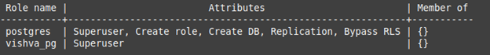

**Showing database**
```sh
postgres=# \l
```
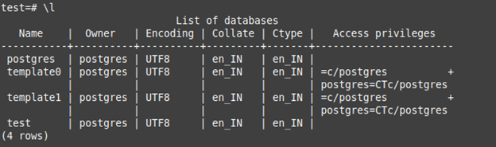

**Changing the database in PSQL**   
```sh
postgres=# \c databseName;
```


**Showing tables**  
```sh
test=# \dt
```
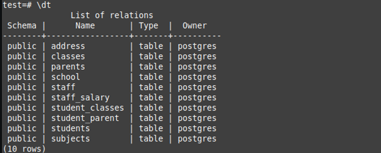

**STARTING THE POSTGRES SERVICES IN UBUNTU**

follow the below step in-order to install the postgres and pgadmin

\<https://www.tecmint.com/install-postgresql-and-pgadmin-in-ubuntu/\>

$ service postgresql   
Usage: /etc/init.d/postgresql {start|stop|restart|reload|force-reload|status} [version ..]

$ service postgresql start     

$ service postgresql status   
```
● postgresql.service - PostgreSQL RDBMS
Loaded: loaded (/lib/systemd/system/postgresql.service; enabled; vendor preset: enabled)
Active: active (exited) since Mon 2023-05-01 13:33:45 IST; 1h 3min ago
Main PID: 1073 (code=exited, status=0/SUCCESS)
Tasks: 0 (limit: 14008)
Memory: 0B
CGroup: /system.slice/postgresql.service
May 01 13:33:45 vishvapc systemd[1]: Starting PostgreSQL RDBMS...
May 01 13:33:45 vishvapc systemd[1]: Finished PostgreSQL RDBMS...
```


**DATABASE AND USERS**  

**DATABASE:** `postgres=# \l`

USERS: `postgres=# \du`

**CHANGING THE PASSWORD FOR DEFAUL USER:**   
`postgres=# ALTER USER postgres WITH PASSWORD 'pglogin';`

```SQL
--OUTPUT
OUTPUT: ALTER ROLE   
--once you above output came means user password has been set.
```

**CREATING THE NEW USER**  
`postgres=# CREATE USER vishva_pg WITH PASSWORD 'pglogin';`
```SQL
--OUTPUT
CREATE ROLE
--once you saw the `CREATE ROLE` meaning the user has been created successfully.
```

`postgres=# \du`   
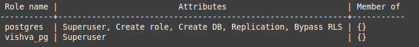     
NOTE: after creating the user you have to provide the user privileges.

**GRANTING USER ACCESS:**     
`postgres=# ALTER USER vishva\_pg WITH SUPERUSER;`
```SQL
--OUTPUT
ALTER ROLE
```

**DELETING THE USER:**    
postgres=# CREATE USER userNameTest WITH PASSWORD 'asdfahsd@123';   
CREATE ROLE

postgres=# DROP USER usernametest;    
DROP ROLE

postgres=#    
postgres=# \du      


**CONNECTING THROUGH THE PGADMIN WEBUI:**   
#STEP 1: check the status of apache server:   
`$sudo service apache2 status`


#STEP 2: login to postgres and see the below status   
`$service postgresql`    
`Usage: /etc/init.d/postgresql {start|stop|restart|reload|force-reload|status} [version ..]`     
if services is offline then start it then login


#STEP 3: Below are the link to login through pgadmin web    
You can now start using pgAdmin 4 in web mode at     
[http://127.0.0.1/pgadmin4](http://127.0.0.1/pgadmin4)


**STEP 1:** check the status of apache server:     
$sudo service apache2 status


**STEP 2:** login to postgres and see the below status    
$service postgresql    
`Usage: /etc/init.d/postgresql {start|stop|restart|reload|force-reload|status} [version ..]`

if services is offline then start it then login


**STEP 3:** Below are the link to login through pgadmin web    
#You can now start using pgAdmin 4 in web mode at    
[http://127.0.0.1/pgadmin4](http://127.0.0.1/pgadmin4)


BELOW ARE THE USER ID AND PASSWORD:    
contact.vdubey@gmail.com

asdfahsd@123
________________________________________
[↵ Back to content](sql.md#content)


**APACHE SERVER**   
**OPTION 1ST:**   
First you check your status using this command   
$sudo service apache2 status    
#then stop the running service   
$sudo service apache2 stop   
#then use this command:    
$sudo /opt/lampp/lampp start


**OPTION 2ND(systemctl):**   
You can use the `systemctl` command for apache service restarting; this controls the systemd system and service manager.

**for Restarting Apache With systemctl Command:**    
`$sudo systemctl restart apache2.service`

In case of being hang up or getting no response on restarting you can use the systemctl stop command to stop the service then start with the systemctl start command. Commands are as follows

**For Stopping Apache With systemctl Command:**      
`$sudo systemctl stop apache2.service`


**For Starting Apache With systemctl Command:**     
`$sudo systemctl start apache2.service`


**You can also use the reload command for only reloading the apache service.**    

**For Reloading Apache With systemctl Command:**       
`$sudo systemctl reload apache2.service`
____________________________________________
[↵ Back to content](sql.md#content)


# 02-SQL-JOIN

A JOIN clause is used to combine rows from two or more tables, based on
a related column between them. **

The join keyword merges two or more tables and creates a temporary image
of the merged table. Then according to the conditions provided, it
extracts the required data from the image table, and once data is
fetched, the temporary image of the merged tables is dumped.

 

**Create the sample employee database to understand the join(we are
going to create under emp schema)**

```sql
CREATE SCHEMA IF NOT EXISTS schema_name AUTHORIZATION user_name; -- creating schema

--i.e:

`CREATE SCHEMA IF NOT EXISTS emp AUTHORIZATION postgres;`
```

**Help**
```
[user_name]=postgres
[schema_name]=emp
```

**creating employee table under emp schema**
```sql
drop table if exists emp.employee;

create table if not exists emp.employee
(
emp_id varchar(20),
emp_name varchar(50),
salary int,
dept_id varchar(20),
manager_id varchar(20)
);

-- sample records
insert into emp.employee values
('E1', 'Rahul', 15000, 'D1', 'M1'),
('E2', 'Manoj', 15000, 'D1', 'M1'),
('E3', 'James', 55000, 'D2', 'M2'),
('E4', 'Michael', 25000, 'D2', 'M2'),
('E5', 'Ali', 20000, 'D10', 'M3'),
('E6', 'Robin', 35000, 'D10', 'M3');
```


**Creating department table under emp schema**
```sql
drop table if exists emp.department;

create table if not exists emp.department
(
dept_id varchar(20),
dept_name varchar(50)
); 

-- Sample records
insert into emp.department values
('D1', 'IT'),
('D2', 'HR'),
('D3', 'Finance'),
('D4', 'Admin');
```
 

**Creating manager table under emp schema**
```sql
drop table if exists emp.manager;

create table if not exists emp.manager
(
manager_id varchar(20),
manager_name varchar(50),
dept_id varchar(20)
); 

-- Sample records

insert into emp.manager values
('M1', 'Prem', 'D3'),
('M2', 'Shripadh', 'D4'),
('M3', 'Nick', 'D1'),
('M4', 'Cory', 'D1');
```


**Creating product table under emp schema**
```sql
drop table if exists emp.projects;

create table if not exists emp.projects
(
project_id varchar(20),
project_name varchar(100),
team_member_id varchar(20)
);

-- Sample records

insert into emp.projects values
('P1', 'Data Migration', 'E1'),
('P1', 'Data Migration', 'E2'),
('P1', 'Data Migration', 'M3'),
('P2', 'ETL Tool', 'E1'),
('P2', 'ETL Tool', 'M4');
```
 

 **Below are the all table under emp schema**
```sql
SELECT * FROM emp.employee;
SELECT * FROM emp.department;
SELECT * FROM emp.manager;
SELECT * FROM emp.projects;
```
[↵ Back to content](sql.md#content)


**Q1. FETCH THE EMPLOYEE NAME AND THE DEPARTMENT NAME THEY BELONG TO:**  
In order to fetch the employee name and department name we need to join the tables{employee and department} to fetch these detail.


## 02-01-INNER-JOIN-OR-JOIN
- **Only return the matching value from both the table.** **
- It can represented by keyword "join" or "inner join" in any case.
- **ON Condition:** Column which present in both table. Column name can be different but the value should be present in the table.
- with using inner join lets try to solve the above problem:

```sql
SELECT
emp_table.emp_name,
dep_table.dept_name
FROM emp.employee emp_table
INNER JOIN emp.department dep_table
ON emp_table.dept_id=dep_table.dept_id;
```
[↵ Back to content](sql.md#content)


**Q2 FETCH THE ALL EMPLOYEE NAME AND THE DEPARTMENT NAME THEY BELONG TO:**    
In-order to fetch the employee name and department name we need
to join the tables{employee and department} to fetch these
detail.

## 02-02-LEFT-JOIN-LEFT-OUTER-JOIN

- **LEFT JOIN = INNER JOIN + any additional records in the left table.** **
- In case of if any record present in left table but not present in right then we will get the Null as result.
- In case of join condition fail, it will return the "null" for right table but from left table all the records will return.
- With using inner join lets try to solve the above problem.

```sql
SELECT
emp_table.emp_name,
dep_table.dept_name
FROM emp.employee emp_table
LEFT JOIN emp.department dep_table
ON emp_table.dept_id=dep_table.dept_id;
```
[↵ Back to content](sql.md#content)


## 02-03-RIGHT-JOIN-RIGHT-OUTER-JOIN

- **RIGHT JOIN = INNER JOIN + any additional records in the right table.** **
- In case of if any record present in right table but not present in left then we will get the Null as result.
- In case of join condition fail, it will rerun the "null" for lef ttable but from right table all the records will return.
- With using inner join lets try to solve the above problem.

 
```sql
SELECT
emp_table.emp_name,
dep_table.dept_name
FROM emp.employee emp_table
RIGHT JOIN emp.department dep_table
ON emp_table.dept_id=dep_table.dept_id;
```


**Select all the tables:**
```sql
SELECT * FROM emp.employee;
SELECT * FROM emp.department;
SELECT * FROM emp.manager;
SELECT * FROM emp.projects;
```
 

**Fetch details of all emp, their manager, their department and the projects they work on.**
```sql
SELECT e.emp_name, m.manager_name, d.dept_name, p.project_name
FROM emp.employee e
JOIN emp.manager m ON m.manager_id = e.manager_id
LEFT JOIN emp.department d ON d.dept_id = e.dept_id
LEFT JOIN emp.projects p ON p.team_member_id=e.emp_id;
```
[↵ Back to content](sql.md#content)


**Creating some sample schema to understand the other joins**
```sql
drop table if exists employee;
create table if not exists employee
(
	emp_id			varchar(20),
	emp_name		varchar(50),
	salary			int,
	dept_id			varchar(20),
	manager_id		varchar(20)
);
insert into employee values
('E1', 'Rahul', 15000, 'D1', 'M1'),
('E2', 'Manoj', 15000, 'D1', 'M1'),
('E3', 'James', 55000, 'D2', 'M2'),
('E4', 'Michael', 25000, 'D2', 'M2'),
('E5', 'Ali', 20000, 'D10', 'M3'),
('E6', 'Robin', 35000, 'D10', 'M3');


drop table if exists department;
create table if not exists department
(
	dept_id			varchar(20),
	dept_name		varchar(50)
);
insert into department values
('D1', 'IT'),
('D2', 'HR'),
('D3', 'Finance'),
('D4', 'Admin');

drop table if exists company;
create table if not exists company
(
	company_id		varchar(10),
	company_name	varchar(50),
	location		varchar(20)
);
insert into company values
('C001', 'techTFQ Solutions', 'Kuala Lumpur');

insert into company values
('C002', 'techTFQ Media Group', 'Singapore');


DROP TABLE if exists family;
CREATE TABLE if not exists family
(
    member_id     VARCHAR(10),
    name          VARCHAR(50),
    age           INT,
    parent_id     VARCHAR(10)
);
insert into family values
  ('F1', 'David', 4, 'F5'),
  ('F2', 'Carol', 10, 'F5'),
  ('F3', 'Michael', 12, 'F5'),
  ('F4', 'Johnson', 36, ''),
  ('F5', 'Maryam', 40, 'F6'),
  ('F6', 'Stewart', 70, ''),
  ('F7', 'Rohan', 6, 'F4'),
  ('F8', 'Asha', 8, 'F4');
```

Run above sql query to create table to undertand rest joins.    
[↵ Back to content](sql.md#content)


## 02-04-Full-Join
- **INNER JOIN + all remaining records from left + all remaining records from right table.** **
- It is also called **full outer join**. `outer` keyword is optional.
- Return all the records from both table.
- substituting NULL for any row value that is not present in the other table.

```sql
FULL Join = INNER Join + all remaining records from Left Table (returns null value for any columns fetched from right table) 
                       + all remaining records from Right Table (returns null value for any columns fetched from left otable)

FULL JOIN = INNER JOIN + LEFT JOIN + RIGHT JOIN                       
```

**Example**    
```sql
select e.emp_name, d.dept_name
from employee e
full join department d on d.dept_id=e.dept_id;
```


**Below keyword have same functionality**
```sql
left join ==> left outer join
right join ==> right out join
inner join ==> join
full join ==> full outer join
```

[↵ Back to content](sql.md#content)


## 02-05-Cross-Join
- A cross join is a join operation that produces the `Cartesian product` of two or more tables. **
- In Math, a **Cartesian product** is a mathematical operation that returns a product set of multiple sets.
- For example, with two sets A {x,y,z} and B {1,2,3}, the Cartesian product of A x B is the set of all ordered pairs (x,1), (x,2), (x,3), (y,1) (y,2), (y,3), (z,1), (z,2), (z,3).
- Does required the join condition.


The following picture illustrates the Cartesian product of A and B:   

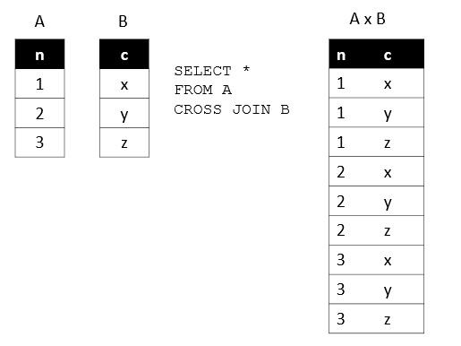


**Example**
```sql
select e.emp_name, d.dept_name
from employee e --6
cross join department d ; --4
```


**Problem01:**    
Write a query to fetch the employee name and their corresponding department name.
also make sure to display the company name and the company location corresponding to each employee.

```sql
--CROSS JOIN
select e.emp_name, d.dept_name, c.company_name, c.location
from employee e
inner join department d on e.dept_id=d.dept_id
cross join company c;
```
[↵ Back to content](sql.md#content)


## 02-06-Natural-Join
- A NATURAL JOIN is a JOIN operation that creates an implicit join clause for you based on the common columns in the two tables being joined. Common columns are columns that have the same name in both tables.
- A NATURAL JOIN can be an [INNER join](#02.01), a [LEFT OUTER join](#02.02), or a [RIGHT OUTER join](#02.03). The default is [INNER join](#02.01).
- Not a recommenced join since the system decide on which column name need to join the table.
- if system found the common column between table then it will perform the inner join else it will perform the full join.


**Create the sample table to understand the Natural Join**
```sql
create table if not exists table1(
id int
);
create table if not exists table2(
id int
);


-- insert the sample records in table1
insert into table1 values
(1),
(1),
(1),
(2),
(3),
(3),
(3);


-- insert the sample records in table2
insert into table2 values
(1),
(1),
(2),
(2),
(4),
(NULL);


--select query
select * from table1;
select * from table2;


-- NATURAL JOIN 
SELECT * FROM table1 t1
NATURAL JOIN table2 t2;
```

Since we have same column name(id) in both tables it will perform the inner join and we will get the below result:    

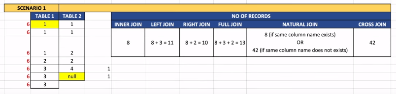


Let's understand to change one of the table name to see how it does like cross join:    

```sql
-- RENAMING THE TABLE1 COLUMN ID TO ID_NEW
alter table table1 rename column id to id_new;


-- NATURAL JOIN 
SELECT * FROM table1 t1
NATURAL JOIN table2 t2;
```

Now YOU can see we are gating the 42 records since there isn't any matching columns between both the tableS.   

**SAMPLE OUTPUT**   
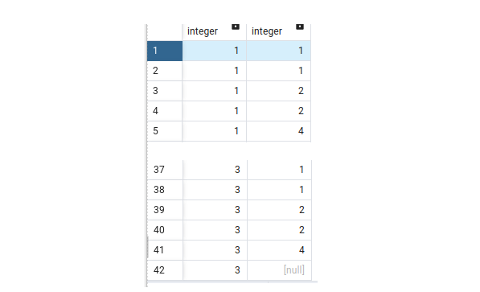

[↵ Back to content](sql.md#content)


## 02-07-WrapUP-the-Join

lets create the sample table3 and table4 to understand the all join:

```sql
--Creating table3
create table if not exists table3(
id int
);


--Creating the table4
create table if not exists table4(
id int
);


--inserting sample value in table3
insert into table3 values
(1),
(1),
(1),
(1),
(1),
(NULL),
(NULL);


--inserting sample value in table4
insert into table4 values
(1),
(1),
(1),
(2),
(NULL);


select * from table3;
select * from table4;
```


**Problem1** how many records will return in inner join:

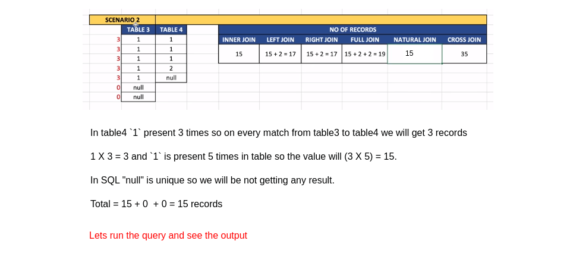

```sql
-- inner join
select * from table3 t3
join table4 t4
on t3.id=t4.id;
```
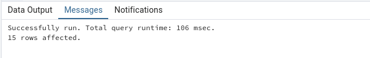


**Problem2** How many records will return in the left join   
```sql
-- Left Join
select * from table3 t3
left join table4 t4
on t3.id=t4.id;

-- it should return the 17 records 
-- inner join + Non-matching records from left table(which are 2 nulls)
-- 15 + 2 = 17
```
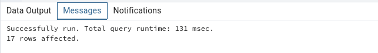


**Problem3** How many records will return in the right join   
```sql
-- Right Join
select * from table3 t3
right join table4 t4
on t3.id=t4.id;

-- it should return the 17 records 
-- inner join + Non-matching records from right table(which is 2 and nulls)
-- 15 + 2 = 17
```


**Problem4** How many records will return in the full join   
```sql
-- Full Join
select * from table3 t3
full join table4 t4
on t3.id=t4.id;

-- it should return the 19 records 
-- inner join + Non-matching records from right table(which is 2 and nulls) + Non-matching records from left table(which are 2 nulls)

-- 15 + 2 + 2= 19
```
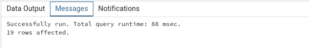


**Problem5** How many records will return in the Natural join   
```sql
-- natural Join
select * from table3 t3
natural join table4 t4;

-- it should return the 15 records 
-- in both table3 and table4 the column(id) is matching so it will perform the inner join
-- else it will perform the cross join

-- so its should return the 15
```


**Problem6** How many records will return in the cross join   
```sql
-- Full Join
select * from table3 t3
cross join table4 t4;

-- it should return the 35 records 
-- table3 = 7 and table4 = 5( 7 X 5 = 35)
-- so its should return the 35
```
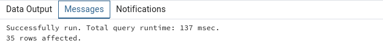

[↵ Back to content](sql.md#content)


# 03-SUB-QUERY
- In SQL, a SELECT statement may contain another SQL statement, known as a subquery or nested query.
- for more Please [click here](https://www.programiz.com/sql/subquery) to read the notes by programiz.


In a subquery, the outer query's result depends on the result set of the inner subquery. That's why subqueries are also called **nested queries**.

Here is how this code works:

executes the subquery first (inner query), and returns the minimum age 22 executes the outer query, and selects customers with age 22
```sql
SELECT * 
FROM customers
WHERE age=(
SELECT MIN(age)  ---> the inner query is replaced with a single value.
FROM customers
)
```

FOR UNDERSTAND LETS CREATE THE BELOW TABLES:       
```sql
DROP TABLE employee_history;
DROP TABLE EMPLOYEE;
drop table department;
DROP table sales ;

create table department
(
	dept_id		int ,
	dept_name	varchar(50) PRIMARY KEY,
	location	varchar(100)
);
insert into department values (1, 'Admin', 'Bangalore');
insert into department values (2, 'HR', 'Bangalore');
insert into department values (3, 'IT', 'Bangalore');
insert into department values (4, 'Finance', 'Mumbai');
insert into department values (5, 'Marketing', 'Bangalore');
insert into department values (6, 'Sales', 'Mumbai');

CREATE TABLE EMPLOYEE
(
    EMP_ID      INT PRIMARY KEY,
    EMP_NAME    VARCHAR(50) NOT NULL,
    DEPT_NAME   VARCHAR(50) NOT NULL,
    SALARY      INT,
    constraint fk_emp foreign key(dept_name) references department(dept_name)
);
insert into employee values(101, 'Mohan', 'Admin', 4000);
insert into employee values(102, 'Rajkumar', 'HR', 3000);
insert into employee values(103, 'Akbar', 'IT', 4000);
insert into employee values(104, 'Dorvin', 'Finance', 6500);
insert into employee values(105, 'Rohit', 'HR', 3000);
insert into employee values(106, 'Rajesh',  'Finance', 5000);
insert into employee values(107, 'Preet', 'HR', 7000);
insert into employee values(108, 'Maryam', 'Admin', 4000);
insert into employee values(109, 'Sanjay', 'IT', 6500);
insert into employee values(110, 'Vasudha', 'IT', 7000);
insert into employee values(111, 'Melinda', 'IT', 8000);
insert into employee values(112, 'Komal', 'IT', 10000);
insert into employee values(113, 'Gautham', 'Admin', 2000);
insert into employee values(114, 'Manisha', 'HR', 3000);
insert into employee values(115, 'Chandni', 'IT', 4500);
insert into employee values(116, 'Satya', 'Finance', 6500);
insert into employee values(117, 'Adarsh', 'HR', 3500);
insert into employee values(118, 'Tejaswi', 'Finance', 5500);
insert into employee values(119, 'Cory', 'HR', 8000);
insert into employee values(120, 'Monica', 'Admin', 5000);
insert into employee values(121, 'Rosalin', 'IT', 6000);
insert into employee values(122, 'Ibrahim', 'IT', 8000);
insert into employee values(123, 'Vikram', 'IT', 8000);
insert into employee values(124, 'Dheeraj', 'IT', 11000);


CREATE TABLE employee_history
(
    emp_id      INT PRIMARY KEY,
    emp_name    VARCHAR(50) NOT NULL,
    dept_name   VARCHAR(50),
    salary      INT,
    location    VARCHAR(100),
    constraint fk_emp_hist_01 foreign key(dept_name) references department(dept_name),
    constraint fk_emp_hist_02 foreign key(emp_id) references employee(emp_id)
);

create table sales
(
	store_id  		int,
	store_name  	varchar(50),
	product_name	varchar(50),
	quantity		int,
	price	     	int
);
insert into sales values
(1, 'Apple Store 1','iPhone 13 Pro', 1, 1000),
(1, 'Apple Store 1','MacBook pro 14', 3, 6000),
(1, 'Apple Store 1','AirPods Pro', 2, 500),
(2, 'Apple Store 2','iPhone 13 Pro', 2, 2000),
(3, 'Apple Store 3','iPhone 12 Pro', 1, 750),
(3, 'Apple Store 3','MacBook pro 14', 1, 2000),
(3, 'Apple Store 3','MacBook Air', 4, 4400),
(3, 'Apple Store 3','iPhone 13', 2, 1800),
(3, 'Apple Store 3','AirPods Pro', 3, 750),
(4, 'Apple Store 4','iPhone 12 Pro', 2, 1500),
(4, 'Apple Store 4','MacBook pro 16', 1, 3500);


select * from employee;
select * from department;
select * from employee_history;
select * from sales;

```

**Problem1:**: Find the employees who's salary is more than the average salary earned by all employees.
```sql
SELECT * FROM 
  employee 
WHERE salary > (
  SELECT avg(salary) fROM employee -- inner query
) 
```


1. In above image first inner query is going to return the result.
2. Once inner query result done then outer query is going to filter those employees whose salary is more than the average salary.

we can rewrite the same query using the join
```sql
select * from
employee e
join (select avg(salary) sal from employee) avg_sal
on e.salary>avg_sal.sal;
```


## 03-01-TYPE-OF-SUBQUERY
1. Scalar Subquery
2. Multiple Subquery
3. Correlated Subquery

### 03-01-a-Scalar-SubQuery
- it will return one row and one column

Example:
```sql
SELECT * FROM 
  employee 
WHERE salary > (
  SELECT avg(salary) fROM employee -- inner query --> will return the one column and one row.

--we can rewrite the same query using the join
select * from
employee e
join (select avg(salary) sal from employee) avg_sal
on e.salary>avg_sal.sal;
```


 ### 03-01-b-Multiple-SubQuery
 1. Subquery which returns multiple column and multiple rows.
 2. Subquery which returns one column and multiple rows.

 **PROBLEM01** Find the employees who earn the highest salary in each department.
 ```sql
 
-- multiple column, multiple row subquery
--1) find the highest salary in each department.
--2) filter the employees based on above result.

select *
from employee e
where (dept_name,salary) in (select dept_name, max(salary) from employee group by dept_name)
order by dept_name, salary;


-- Single column, multiple row subquery
/* QUESTION: Find department who do not have any employees */
--1) find the departments where employees are present.
--2) from the department table filter out the above results.

select *
from department
where dept_name not in (select distinct dept_name from employee);
 ```


### 03-01-c-Correlated-SubQuery
- A subquery which is related to the outer query. **
- Correlated subqueries are used for row-by-row processing. Each subquery is executed once for every row of the outer query.
- A correlated subquery is evaluated once for each row processed by the parent statement. The parent statement can be a SELECT, UPDATE, or DELETE statement. 


**Problem01**
Find the employees in each department who earn more than the average salary in that department.
```sql
select * from employee e1 
where salary >(select avg(salary) from employee e2 
			   where e2.dept_name=e1.dept_name)
```

Note: in above query the inner query/subquery will not run without the outer query since we are checking the dept_name from the e1 table.


**Problem02**
Find the department who don't have any employee
```sql
select dept_name
from department d
where not exists (select dept_name from employee e
					   where e.dept_name=d.dept_name)
```
_________________________________________
[↵ Back to content](sql.md#content)


# 04-SQL-WITH-Clause-or-CTE-Query
- CTE => Common Table Expression.
- Also called Sub Query Factoring.  
- It will create the temp table and going to reference that table in entire query.
- Using with clause we can improve the performance if the same query are using multiples times.


```sql
-- Fetch employees who earn more than average salary of all employees

with average_salary(avg_Sal) as 
	(select avg(salary) from employee)
select *
from employee e, average_salary av
where e.salary > av.avg_sal;

```


**Problem02**  
```sql
-- Find stores who's sales where better than the average sales across all stores.
--SOLUTION -> lets divide the problem and understand how can we solve it.
-- 1) Total sales per each store -- Total sales
select s.store_id, sum(price) as total_sales_per_store
from sales s 
group by s.store_id;


--2) Find the average sales with respect all the stores. --Avg_Sales
select cast(avg(total_sales_per_store) as int) as avg_sales_for_all_stores 
from (select s.store_id, sum(price) as total_sales_per_store
from sales s 
group by s.store_id)x;


--3) Find the stores where Total_Sales > Avg_Sales of all stores.
-- Subquery(Final ANS)
select * 
from (
	select s.store_id, sum(price) as total_sales_per_store
	from sales s 
	group by s.store_id
	) total_sales
join (
	select cast(avg(total_sales_per_store) as int) as avg_sales_for_all_stores 
	from (select s.store_id, sum(price) as total_sales_per_store
	from sales s 
	group by s.store_id)x
	) avg_sales
	on total_sales.total_sales_per_store > avg_sales.avg_sales_for_all_stores;


-- USING WITH CLAUSE(Final ANS)
with total_sales(store_id, total_sales_per_store) as
		(select s.store_id, sum(price) as total_sales_per_store
		from sales s 
		group by s.store_id),
	avg_sales(avg_sales_for_all_stores) as
		(select cast(avg(total_sales_per_store) as int) as avg_sales_for_all_stores 
		from total_sales)
select *
from total_sales ts
join avg_sales av
on ts.total_sales_per_store > av.avg_sales_for_all_stores;
```
_________________________________________
[↵ Back to content](sql.md#content)


# 05-Window-Function
Window functions apply to aggregate and ranking functions over a particular window (set of rows). OVER clause is used with window functions to define that window. OVER clause does two things : 

* Partitions rows to form a set of rows. (PARTITION BY clause is used) 
* Orders rows within those partitions into a particular order. (ORDER BY clause is used) 
Note: If partitions aren’t done, then ORDER BY orders all rows of the table. 

Syntax:   
```sql
SELECT coulmn_name1, 
 window_function(cloumn_name2)
 OVER([PARTITION BY column_name1] [ORDER BY column_name3]) AS new_column
FROM table_name;
 
/* 
window_function= any aggregate or ranking function    
column_name1= column to be selected
coulmn_name2= column on which window function is to be applied
column_name3= column on whose basis partition of rows is to be done
new_column= Name of new column
table_name= Name of table
*/
```
**CREATING SAMPLE TABLE**  
```sql
drop table employee;
create table employee
( emp_ID int
, emp_NAME varchar(50)
, DEPT_NAME varchar(50)
, SALARY int);

insert into employee values(101, 'Mohan', 'Admin', 4000);
insert into employee values(102, 'Rajkumar', 'HR', 3000);
insert into employee values(103, 'Akbar', 'IT', 4000);
insert into employee values(104, 'Dorvin', 'Finance', 6500);
insert into employee values(105, 'Rohit', 'HR', 3000);
insert into employee values(106, 'Rajesh',  'Finance', 5000);
insert into employee values(107, 'Preet', 'HR', 7000);
insert into employee values(108, 'Maryam', 'Admin', 4000);
insert into employee values(109, 'Sanjay', 'IT', 6500);
insert into employee values(110, 'Vasudha', 'IT', 7000);
insert into employee values(111, 'Melinda', 'IT', 8000);
insert into employee values(112, 'Komal', 'IT', 10000);
insert into employee values(113, 'Gautham', 'Admin', 2000);
insert into employee values(114, 'Manisha', 'HR', 3000);
insert into employee values(115, 'Chandni', 'IT', 4500);
insert into employee values(116, 'Satya', 'Finance', 6500);
insert into employee values(117, 'Adarsh', 'HR', 3500);
insert into employee values(118, 'Tejaswi', 'Finance', 5500);
insert into employee values(119, 'Cory', 'HR', 8000);
insert into employee values(120, 'Monica', 'Admin', 5000);
insert into employee values(121, 'Rosalin', 'IT', 6000);
insert into employee values(122, 'Ibrahim', 'IT', 8000);
insert into employee values(123, 'Vikram', 'IT', 8000);
insert into employee values(124, 'Dheeraj', 'IT', 11000);
COMMIT;
```

```sql
select * from employee;

-- Using Aggregate function as Window Function
-- Without window function, SQL will reduce the no. of records.
select dept_name, max(salary) from employee
group by dept_name;

--By using MAX as an window function, SQL will not reduce records but the result will be shown corresponding to each record.
select e.*,
max(salary) over(partition by dept_name) as max_salary /*window is going to create for the dept_name*/
from employee e;
```
_________________________________________
[↵ Back to content](sql.md#content)


# 05-01-row_number--rank-and-dense_rank

|Difference|RANK()|DENSE_RANK()|ROW_NUMBER()|
|:--|:--|:--|:--|
|Treatment of Ties|Leaves gaps in the ranking sequence.|Does not leave gaps in the ranking sequence.|Does not consider ties; each row receives a distinct rank.|
|Handling of Duplicates|Treats tied values as duplicates and assigns the same rank.|Treats tied values as duplicates and assigns the same rank.|Does not consider ties; each row receives a distinct row number.|
|Presence of Gaps|Leaves gaps in the ranking sequence.|Does not leave gaps in the ranking sequence.|Does not leave gaps in the numbering sequence.|
|Performance Implications|May perform better with many duplicates due to the potential to skip ranks.|May perform better with many duplicates due to the potential to skip ranks.|Might have slightly worse performance for large datasets due to generating unique row numbers.|
|Common Use Cases|Useful when gaps in ranking sequence are acceptable.|Ideal when gaps in ranking sequence are not desired.|Suitable for situations where a unique identifier for each row is needed.|


```sql
--assign the row number for each record in employee table
--in this case a rn column will be going to add and for each record incremental value will be going
--to assign.
select e.*,
row_number() over() as rn
from employee e;

--assing the row number for each record from employee table based on dept_name.
select e.*,
row_number() over(partition by dept_name) as rn
from employee e;


-- Fetch the first 2 employees from each department to join the company.
select * from (
	select e.*,
	row_number() over(partition by dept_name order by emp_id) as rn
	from employee e) x
where x.rn < 3;


-- Fetch the top 3 employees in each department earning the max salary.
select e.*,
rank() over(partition by dept_name order by salary desc) as rnk
from employee e;
-- in above query we have used the rank() function where which is going to assign the incremental
-- value based on salary. in case of duplicate salary then next rank will be going to skip
-- this we can handle in dense_rank() which is not going to skip.
-- dense_rank() function will assign the incremental number based and  it does not leave gaps 
-- in the ranking sequence when there are ties. If two or more rows have the same values, 
-- they will be assigned the same rank, and the next rank in the sequence will be 
-- incremented by the number of tied rows.
-- Solving the above problem using dese_rank():
select * from (
	select e.*,
	rank() over(partition by dept_name order by salary desc) as rnk
	from employee e) x
where x.rnk < 4;


-- Checking the different between rank, dense_rnk and row_number window functions:
select e.*,
rank() over(partition by dept_name order by salary desc) as rnk,
dense_rank() over(partition by dept_name order by salary desc) as dense_rnk,
row_number() over(partition by dept_name order by salary desc) as rn
from employee e;
```
_________________________________________
[↵ Back to content](sql.md#content)


# 05-02-lead-and-lag 

|Difference|LEAD()|LAG()|
|:--|:--|:--|
|Returns|Returns the value of the specified column from the next row in the result set.|Returns the value of the specified column from the previous row in the result set.|
|Syntax|LEAD(column_name [, offset [, default_value]]) OVER (ORDER BY ...)|LAG(column_name [, offset [, default_value]]) OVER (ORDER BY ...)|
|Behavior at Boundary|Allows specifying a default value to return if there is no next row (or if the offset goes beyond the end of the partition).|Allows specifying a default value to return if there is no previous row (or if the offset goes beyond the beginning of the partition).|
|Example|LEAD(sales_amount) OVER (ORDER BY sales_date)|LAG(sales_amount) OVER (ORDER BY sales_date)|
|Common Use Cases|Useful for comparing values with subsequent rows, analyzing trends, or forecasting future values.|Useful for comparing values with preceding rows, analyzing trends, or detecting changes in data.|

```sql
-- fetch a query to display if the salary of an employee is higher, lower or equal to the previous employee.
select e.*,
lag(salary) over(partition by dept_name order by emp_id) as prev_empl_sal,
case when e.salary > lag(salary) over(partition by dept_name order by emp_id) then 'Higher than previous employee'
     when e.salary < lag(salary) over(partition by dept_name order by emp_id) then 'Lower than previous employee'
	 when e.salary = lag(salary) over(partition by dept_name order by emp_id) then 'Same than previous employee' end as sal_range
from employee e;

-- Similarly using lead function to see how it is different from lag.
select e.*,
lag(salary) over(partition by dept_name order by emp_id) as prev_empl_sal,
lead(salary) over(partition by dept_name order by emp_id) as next_empl_sal
from employee e;
```

# ** The End **