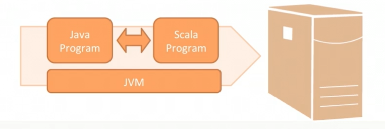

# Content
1. [1-Overview-and-Syntax-Basic](#1-Overview-and-Syntax-Basic)
	1. [1-Overview-and-Syntax-Basic](#1-Overview-and-Syntax-Basic)
		1. [1-1-Scala-Features](#1-1-Scala-Features)
			1. [1-1-1-Scala-and-JVM](#1-1-1-Scala-and-JVM)
			2. [1-1-2-Functional-Paradigm](#1-1-2-Functional-Paradigm)
			3. [1-1-3-Object-Oriented-Paradigm](#1-1-3-Object-Oriented-Paradigm)
		2. [1-2-Installing-Scala](#1-2-Installing-Scala)
		3. [1-3-Scala-REPL](#1-3-Scala-REPL)
		4. [1-4-Scala-Variable](#1-4-Scala-Variable)
			1. [1-4-1-Value-Types](#1-4-1-Value-Types)
		5. [1-5-Scala-Function](#1-5-Scala-Function)
			1. [1-5-1-Anonymous-Function](#1-5-1-Anonymous-Function)
			2. [1-5-2-Scala-Method](#1-5-2-Scala-Method)
		6. [1-6-Scala-Object](#1-6-Scala-Object)
			1. [1-6-1-Companion-Object.](#1-6-1-Companion-Object.)

--------------------------

# 1-Overview-and-Syntax-Basic
## 1-1-Scala-Features
### 1-1-1-Scala-and-JVM
- Stand for Scalable Language and it is concise <font color="#f79646">expression-based programming</font> language.
- It is a multiparadigm language like java and <font color="#f79646">support object-oriented</font> programming.
- Also provide functional programming(unlike Java)
- Source code is more concise.
- Scala runs on JVM -> It complies to Java bytecode -> Able to run on JVM
- Java interoperability is built in



### 1-1-2-Functional-Paradigm
- Support Pure and Higher order functions
	- <font color="#f79646">HIGER ORDER FUNCTION:</font> It takes function as input parameters or return another functions as its results.
- <font color="#f79646">Functions are first class citizens:</font>
	- We can assign function definitions as variables, pass functions as parameters to other functions and even have a function return another function.
- <font color="#f79646">Functional Composition:</font>
```scala
j compose k return j(k(x))
j andThen k return k(j(x))
```

### 1-1-3-Object-Oriented-Paradigm
- Scala does OO
	- Inheritance, polymorphism etc.
- In fact everything is an object
- <font color="#f79646">No Primitives</font>
	- scala.Double
	- scala.Float
	- scala.Byte
	- scala.Boolean
	- etc
- No Static methods or fields in scala.


## 1-2-Installing-Scala

## 1-3-Scala-REPL
- REPL Stand for read evaluate print and loop.
- it provides the immediate feedback.
- It uses the whitespace or code block position in to determine the end of an expression(no need to specify the semicolon)
- we can also define the variable using type or without type
```scala
scala> val d = 5 + 5
val d: Int = 10

scala> val f: Int = 4 + 3
val f: Int = 7

scala> val s = "skillSoft"
val s: String = skillSoft

scala> 6 + 10
val res0: Int = 16 // returning the system assigned variable res0

scala> println(res0)
16 // as res0 is defined by system above; we can see the value 16 is returning.
```


## 1-4-Scala-Variable
- Variables are usually 2 types
	- 1. Value variable
	- 2. Reference variable
```scala
scala> val d = 2 + 5
val d: Int = 7

scala> val returnIntVal: Int = 6 + 3
val returnIntVal: Int = 9

scala> val s = "SkillSoft"
val s: String = SkillSoft

scala> val combined = 3 + "SkillSoft"
warning: 1 deprecation (since 2.13.0); for details, enable `:setting -deprecation` or `:replay -deprecation`
val combined: String = 3SkillSoft

scala> def myFunc(value: Boolean) = if(value) 5000 else "False"
def myFunc(value: Boolean): Any
```

1. <font color="#f79646">Declaration:</font> Variables in Scala are declared using the `var` or `val` keywords. `var` is for mutable variables (can be changed), while `val` is for immutable variables (cannot be changed once assigned).

2. <font color="#f79646"> Type Inference: </font>Scala can *`automatically infer the type of a variable`* based on the assigned value, but you can also specify the type explicitly.

3. <font color="#f79646">Scope</font>: Variables in Scala can be local (declared within a method or block) or global (declared outside of any method, typically at the top of a class or object).

4. <font color="#f79646">Initialization</font>: Variables must be initialized when they are declared. Uninitialized variables will cause a compile-time error.

Here is an example:

```scala
val immutableVar: Int = 10 // immutable variable
var mutableVar = 20       // mutable variable with inferred type
mutableVar = 30           // changing the value of mutable variable
```

### 1-4-1-Value-Types
In scala AnyVal is the root class of all value types listed below.
1. Numeric
	1. scala.Float
	2. scala.Double
	3. scala.Long
	4. scala.Int
	5. scala.Short
	6. scala.Byte
	7. scala.Char
2. Non-numeric
	1. scala.Boolean
	2. scala.Unit
```scala
scala> val immutableVariable = 4
val immutableVariable: Int = 4

scala> immutableVariable = 6
                         ^
       error: reassignment to val

scala> immutableVariable
val res2: Int = 4

scala>

scala> var d = 3
var d: Int = 3

scala> d = 5
// mutated d

scala> d = "SkillSoft"
           ^
       error: type mismatch;
        found   : String("SkillSoft")
        required: Int
// can not assinged the diffrent type value. It should be as initial type varualbe when var defines.
```


> [!NOTE]
> AnyVal is the root class of all variable.   
> Val --> immutable --> cannot reassign the value    
> Var --> Mutable --> can be reassign the value --> Type should be same as initial defined value.   


## 1-5-Scala-Function

1. **Declaration**: Functions in Scala are declared using the `def` keyword, followed by the function name, parameters, return type, and the function body.

2. **Parameters**: Functions can take zero or more parameters. The parameter list is enclosed in parentheses and each parameter must have a type.

3. **Return Type**: The return type of a function is specified after the parameter list and a colon. Scala can often infer the return type, so specifying it is optional but recommended for clarity.

4. **Function Body**: The function body contains the code to be executed and is enclosed in curly braces `{}`. If the function body is a single expression, the braces can be omitted.

5. **Invocation**: Functions are called by using their name followed by the argument list in parentheses.
6. scala support higher order function which takes another function as arguments

Here is an example:

```scala
// Function that takes two integers and returns their sum
def add(a: Int, b: Int): Int = {
  a + b
}

// Function that takes no parameters and returns a greeting message
def greet(): String = "Hello, Scala!"

// Invoking the functions
val sum = add(5, 3) // sum will be 8
val message = greet() // message will be "Hello, Scala!"
```

### 1-5-1-Anonymous-Function
- it is also known as lambda function
- <font color="#f79646">it is function that doesn't have a name and is defined inline</font>

Here are some key points about anonymous functions in Scala:

1. **Syntax**: Anonymous functions use the `=>` symbol to separate the parameters from the function body. The syntax is: `val/var FuncName = (parameters) => expression`.

2. **Usage**: Often used in higher-order functions (functions that take other functions as parameters or return them), such as in collections' `map`, `filter`, and `reduce` methods.

3. **Type Inference**: Scala can often infer the types of parameters and the return type, making the function definition concise.

4. **Assignment**: Anonymous functions can be assigned to variables, just like any other value.

Here are some examples:

```scala
// Anonymous function to add two numbers
// also called labda function
val add = (a: Int, b: Int) => a + b

// Using the anonymous function
val result = add(3, 4) // result will be 7

======================================================
/*  
 * ANONYMOUS FUNCTION: * - A function doesn't have a name. * - According to Wikipedia - "a function that is not bound to an identifier" * - It is also called the lambda function */  
val ints = List(1,2,3)  
  
val doubleList = ints.map(_ * 2)  
  
// above is the shorthand way for writing the anonymous function.  
// we can write like this also.  
// LONGER FORM  
val doubleList01 = ints.map((i: Int) => i*2) // or,  
val doubleList02 = ints.map((i) => i*2) // or,  
val doubleList03 = ints.map(i => i*2)  
  
  
// SHORTENING THE ANONYMOUS FUNCTION  
// the anonymous function the above expression is below  
// (i: Int) => i * 2  
// This long form can be shortened, as will be shown in the following steps.  
// First, here’s that longest and most explicit form again:  
val doubleLists = ints.map((i: Int) => i * 2)  
  
// Because scala compiler infer the data so `Int` is not required  
val doubleLists = ints.map((i) => i * 2)  
  
// Because only one argument the parenthesis around `i` is not needed  
val doubleLists = ints.map(i => i * 2)  
  
// Because Scala lets you use the `_` symbol instead of a variable name when the  
// parameter appears only once in your function, the code can be simplified even more:  
val doubleLists = ints.map(_ * 2)  
  
  
/* Going even shorter  
 * In other examples, you can simplify your anonymous functions further. * For instance, beginning with the most explicit form, you can print each * element in `ints` using this anonymous function with the List class foreach method: */ints.foreach((i: Int) => println(i))  
  
// as before `Int` declaration in not required we can skipp  
ints.foreach(i => println(i))  
  
// Because i is used only once in the body of the function,  
// the expression can be further simplified with the _ symbol:  
ints.foreach(println(_))  
  
// Finally, if an anonymous function consists of one method call that takes // a single argument, you don’t need to explicitly name and specify the argument, // so you can finally **write only the name of the method** (here, println):  
ints.foreach(println)
```


> [!NOTE]
> if an anonymous function consists of one method call that takes // a single argument, you don’t need to explicitly name and specify the argument, // so you can finally **write only the name of the method** (here, println):

### 1-5-2-Scala-Method
1. **Definition**: Methods are functions defined within classes or objects in Scala.
2. **Declaration**: Methods use `def`, name, parameters, return type, and body enclosed in braces.
3. **Parameters**: Methods can take multiple typed parameters, enclosed within parentheses.
4. **Return Type**: Return type follows parameter list, inferred or explicitly declared.
5. **Invocation**: Call methods using dot notation on objects or class instances.

```scala
class Calculator {
  // Method to add two numbers
  def add(a: Int, b: Int): Int = {
    a + b
  }
}

// Creating an instance of the class
val calculator = new Calculator()

// Invoking the method
val result = calculator.add(5, 3) // result will be 8

```

## 1-6-Scala-Object
- An object is <span style="background:#fff88f">a class with exactly one instance.</span>
- It is created lazily when **referenced**, like a lazy val.
- As a top-level value, an object is a **singleton**.
```scala
package com.vdubey.a01_scala_basic_pkg.Ball

import java.io._
import scala.math._


// defining the class
class Ball(diameter: Double) {
  var d: Double = diameter
  var c: Double = 0
  
  // defining the method which will calculate the circumference
  def calcCircumference(){
    c = Pi * d
    println(s"Circumference of ball: ${c} unit")
  }
}

object TennisBall {
  def main(args: Array[String]) {
    val BasketBall = new Ball(10)
    BasketBall.calcCircumference()
    
  }
}

// ===================== OUTPUT ====================
// Circumference of ball: 31.41592653589793 unit
// =================================================

```

### 1-6-1-Companion-Object.
- An <span style="background:#b1ffff">object with the same name as a class</span> is a companion object.
- The class with the same name is the <span style="background:#b1ffff">companion class</span>.
- Companion classes and objects<span style="background:#fff88f"> can access each other's private members.</span>
- Use a companion object for methods and values not specific to class instances.
- you must define the class and its companion object in the same source file. 
[Click here to see more](a04-scala-class-object.md#01-04-Singleton-Objects)
