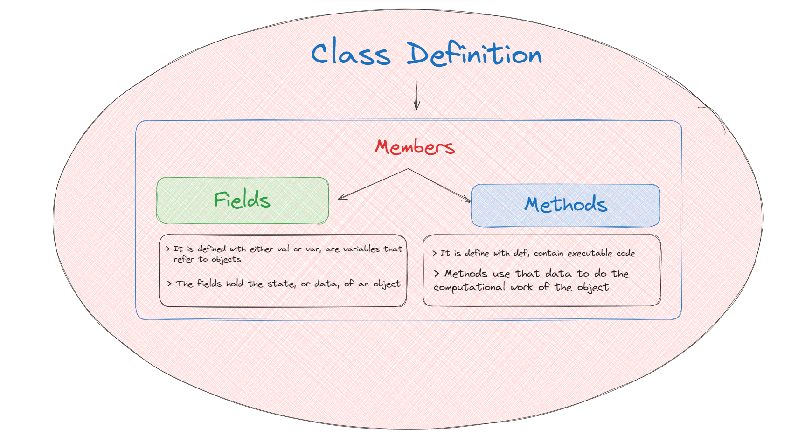
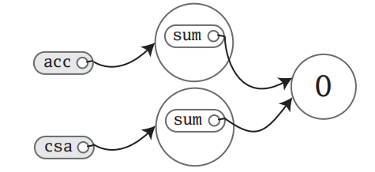
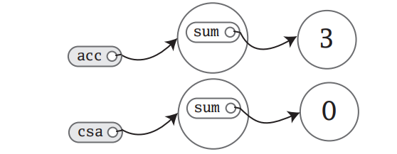

 # Content
1. [01-Scala-Basic-Classes](#01-Scala-Basic-Classes)
	1. [01.01 Classes](a04-scala-class-object.md#01-01-Classes)
	2. [01.02 Fields-and-Methods](a04-scala-class-object.md#01-02-Fields-and-Methods)
	3. [01.03 Access-Specifier](a04-scala-class-object.md#01-03-Access-Specifier)
	4. [01.04-Singleton Objects](a04-scala-class-object.md#01-04-Singleton-Objects)
	5. [01.05-Scala-Application](a04-scala-class-object.md#01-05-Scala-Application)


-----------------
# 01-Scala-Basic-Classes

<b><font color="#f79646">What is Scala ? </font></b>🛢    
Scala is a high-level programming language that combines functional and object-oriented programming paradigms. It is designed to be concise, elegant, and type-safe, making it a powerful tool for building complex software systems.   

## 01-01-Classes
A class is a blueprint for objects. Once you define a class, you can create objects from the class blueprint with the keyword new. For example, given the class definition:   

```scala
class ChecksumAccumulator { 
// class definition goes here 
}

//You can create ChecksumAccumulator objects with: 
new ChecksumAccumulator

```

## 01-02-Fields-and-Methods
Inside a class definition, you place fields and methods, which are collectively called members.   



> [!IMPORTANT]
> **<font color="#f79646">Fields</font>**, which you define with either val or var, are variables that refer to objects. **<font color="#f79646">Methods</font>**, which you define with def, contain executable code. The fields hold the state, or data, of an object, whereas the methods use that data to do the computational work of the object.
> In Scala 2 any fields you are creating should be inside a class or object.

When you initiate the a class, the runtime sets aside some memory to hold the image of that object’s state—i.e., the content of its variables. For example, if you defined a ChecksumAccumulator class and gave it a var field named sum: 

```scala
class ChecksumAccumulator { 
	var sum = 0 
	} 
// and you instantiated it twice with: 

val acc = new ChecksumAccumulator 
val csa = new ChecksumAccumulator
```

The image of the objects in memory might look like:   


Since sum, a field declared inside class ChecksumAccumulator, is a var, not a val, you can later reassign to sum a different Int value, like this:
```scala
acc.sum = 3
```

Now the picture would look like:   


> [!IMPORTANT]
> One thing to notice about this picture is that there are 🔴`two sum variables`, one in the object referenced by `acc` and the other in the object referenced by `csa`. Fields are also known as 🟡`instance variables`, because every instance gets its own set of the variables. Collectively, an object’s instance variables make up the 🔴`memory image of the object`. You can see this illustrated here not only in that you see two sum variables, but also that when you changed one, the other was 🔴**unaffected**.

## 01-03-Access-Specifier
In Scala, access specifiers (or access modifiers) control the visibility of members (fields, methods) of classes and objects. Scala has several access specifiers:   
1. **Public**: `Default`
2. **Private**: `private`
3. **Protected**: `protected`

| Access Specifier | Keyword     | Accessibility                                                                |
| ---------------- | ----------- | ---------------------------------------------------------------------------- |
| Public           | (default)   | Accessible from anywhere. No keyword is needed to declare a public member.   |
| Private          | `private`   | Accessible only within the defining class or object.                         |
| Protected        | `protected` | Accessible within the defining class, its subclasses, and companion objects. |
```scala
class ChecksumAccumulator {
  // Public field (default)
  val publicField = "I am public"

  // Private field
  private val privateField = "I am private"

  // Protected field
  protected val protectedField = "I am protected"

  // Method to access private and protected fields within the class
  def printFields(): Unit = {
    println(publicField)
    println(privateField)
    println(protectedField)
  }
}

// Subclass to demonstrate protected field access
class SubChecksumAccumulator extends ChecksumAccumulator {
  def accessProtectedField(): Unit = {
    println(protectedField) // Accessible because it is protected
  }
}

object Main extends App {
  val acc = new ChecksumAccumulator

  // Accessing the public field
  println(acc.publicField) // Accessible

  // Accessing the private field (will cause a compilation error)
  // println(acc.privateField) // Not accessible

  // Accessing the protected field (will cause a compilation error)
  // println(acc.protectedField) // Not accessible

  acc.printFields() // Accessing all fields within the class

  val subAcc = new SubChecksumAccumulator
  subAcc.accessProtectedField() // Accessing protected field from subclass
}
```


> [!NOTE]
> 1. Public field (default) -- No need to specify -- Accessible from anywhere
> 2. Method can access private and protected fields within the class.

## 01-04-Singleton-Objects
Scala has no static methods or fields. Instead, you use the object construct. An Object defines a single instance of a class with the features that you want.
 * Use keyword object instead of class defining the singleton object.
 * Its create the a instance as soon as if defines.
 * It cannot takes parameters, where as classes takes.

#### COMPANION CLASS AND OBJECT:
when the singleton `object shares the same name with a class`, it is called as class's `COMPANION OBJECT` and the class is called `COMPANION CLASS`.
- you must define the class and its companion object in the same source file. 
- it can share the private fields and methods.

```scala
package com.vdubey.a01_scala_class_pkg
import scala.collection.mutable.Map


object A_01_04_singleton_obj_SO { // companion object // class name = object name 
	class Person(firstName: String, lastName: String){
		// field and methods
	}


	// singleton = one instance of a type is present.
	object ClusterSingleton {
		def MAX_NODES = 28
				def getNumberOfNodes(): Int = { 42 }
	}

	val maxNodes = ClusterSingleton.MAX_NODES
			println("Maximum number of node " + maxNodes)


			// same name of class + object in same file = companions
			class Kid(name: String, age: Int) {
		def greet(): String = s"Hello, my name is $name and I'm $age years old. Do I linke vegetables? ${Kid.LIKES_VEGETABLES}"
	}

	object Kid { // companion object of the class
		private val LIKES_VEGETABLES: Boolean = false
				// preconception
	}


	//  val kidsLikeVegetables = Kid.LIKES_VEGETABLES 
	// can not accessible as using private fields from outside of companions(class + object with same name)

	def main(args: Array[String]) : Unit = {
			val KidDewansh = new Kid("Dewansh", 6)
					println(KidDewansh.greet())
	}
}
```

Click here to see the code here --> [A_01_04_singleton_obj_SO.scala](scala-eclipse-ws/scalaTutorials/src/main/scala/com/vdubey/a01_scala_class_pkg/A_01_04_singleton_obj_SO.scala) ...   


## 01-05-Scala-Application
To run a Scala program, you need to provide the name of a single object (a singleton) that has a main method. This main method should:   
- Take one parameter, which is an array of strings `(Array[String])`
- Return no value (its return type should be Unit).
Any object with this kind of main method can serve as the starting point for your application.

Example:   
Create a object which is entry point of the application as summer   
```scala
package com.vdubey.a01_scala_class_pkg.A_01_05_scala_app_pkg
import com.vdubey.a01_scala_class_pkg.A_01_05_scala_app_pkg.ChecksumAccumulator.calculate

object summer {
  def main(args: Array[String]) {
   val args=Array("is","for", "vacation") // install of invoking the args at runtime defining here
for (arg <- args)
println(arg +": "+ calculate(arg))
}
}
```

Create a Scala class file name as `ChecksumAccumulator.scala`   
```scala
package com.vdubey.a01_scala_class_pkg.A_01_05_scala_app_pkg
import scala.collection.mutable.Map

/*
 * companion = class + object with same name
 * for more check out the below links
 * https://github.com/vishvajeet-dubey/gitnote/blob/main/a05-scala/scala-basic.md#01-04-Singleton-Objects
 * https://github.com/vishvajeet-dubey/gitnote/blob/main/a05-scala/scala-basic.md#01-05-Scala-Application
 * 
 */

class ChecksumAccumulator { // companion class
	// In file ChecksumAccumulator.scala
	private var sum = 0 // will be shared in companion(class + object)
			def add(b: Byte) { sum += b } 
	    // add is method taking byte as b and not returning anything -- it is adding b in sum and reassigning the var sum
	
	def checksum(): Int = ~(sum & 0xFF) + 1
	// checksum is a method taking nothing and returning Int -- and operation of var `sum` and hex value of 255 then not operation
}


// In file ChecksumAccumulator.scala
object ChecksumAccumulator { // Companion object 
  
	private val cache = Map[String, Int]()
	// The calculate method takes a string s and returns its checksum:
			def calculate(s: String): Int = 
			if (cache.contains(s))
				cache(s)
				else {
					val acc = new ChecksumAccumulator
							for (c <- s)
								acc.add(c.toByte)
								val cs = acc.checksum()
								cache += (s -> cs)
								cs
				}
}
```

> [!NOTE]
>  * It first checks if the checksum for the string s is already in the cache.
>  * If it is, it returns the cached checksum.
>  * If it is not, it creates a new ChecksumAccumulator instance (acc).
>  * It then iterates over each character in the string, converts it to a byte, and adds it to the accumulator.
>  * After processing all characters, it calculates the checksum (cs).
>  * It updates the cache with the new checksum (cache += (s -> cs)).
>  * Finally, it returns the newly calculated checksum (cs).


> [!NOTE]
>  * Map Mutation: The code uses Map += to add new entries, but this won't work directly 
>  * since Map is immutable by default. You would need a mutable map or reassign the new 
>  * map back to cache. This can be fixed by using a mutable map:


COMPILING AND RUNNING:   
After compiling with `scalac ChecksumAccumulator.scala Summer.scala`, you can run the compiled Summer object using the Scala runtime:
```sh
$ scala Summer is for vacation
// Need to use entry point of singleton object which contains main method
```

OUTPUT:   
```scala
is: -220   
for: -71   
vacation: -85  
```
 

Above code `scalac` compiles your source files, but there may be a perceptible delay before the compilation finishes. The reason is that every time the compiler starts up, it spends time scanning the contents of jar files and doing other initial work before it even looks at the fresh source files you submit to it. For this reason, the Scala distribution also includes a Scala compiler daemon called fsc (for fast Scala compiler). You use it like this:   
```sh
$ fsc ChecksumAccumulator.scala Summer.scala
```


