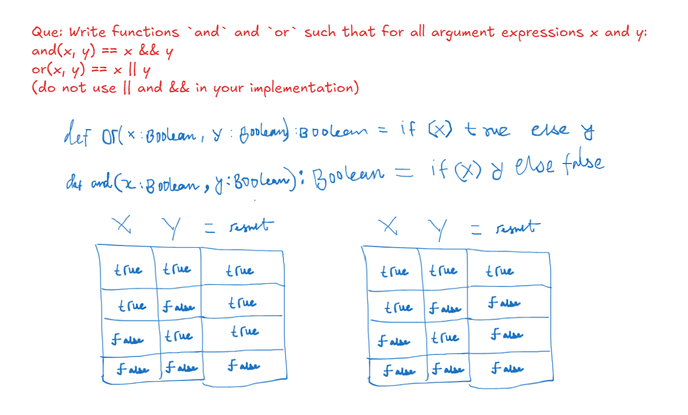
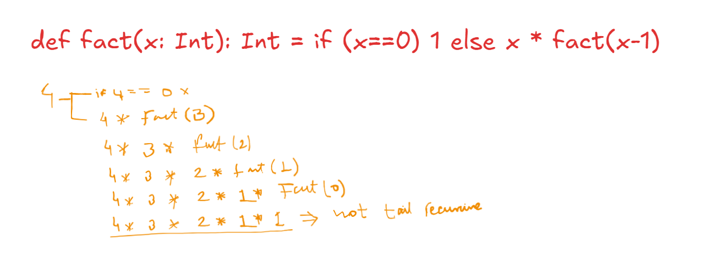
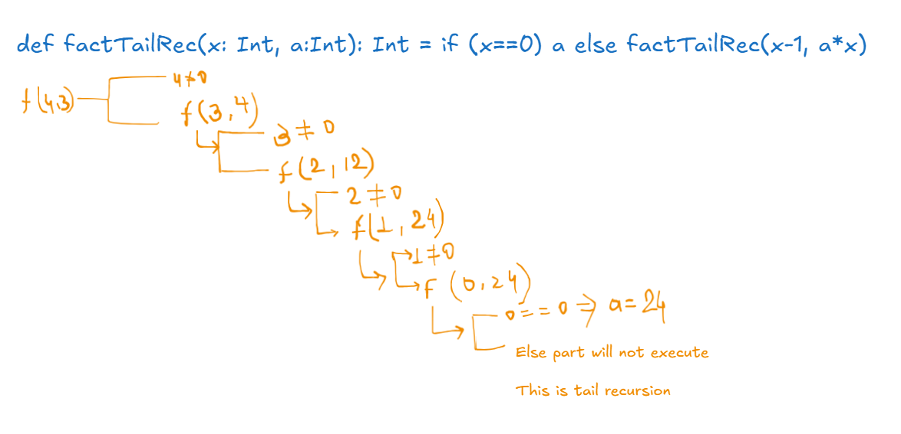

# Lecture-1-1-Programming-Paradigms

### Programming paradigms
+ Imperative programming
+ Functional programming
+ Logic programming
Object oriented programming is orthogonal to the above paradigms.

### Imperative programming
+ Involves modifying mutable variables, using assignments and control structures.

### Functional programming
+ In a stricter sense, FP means programming without mutable variables, assignments, loops and other control structures. Ex: Pure List, Haskell, XSLT
+ In a wider sense, FP means focusing on the functions. Ex: Lisp, Scheme, Racket, Clojure, Scala
+ Functions are first class citizens:
    - Functions can be defined anywhere, within other functions, etc.
    - Can be passed to functions as parameters and returned as results.
    - There are a set of operators that lets us compose functions.

### Recommended Books
+ Structure and Interpretation of Computer Programs (2nd Edition)
Harold Abelson and Gerald Jay Sussman with Julie Sussman
http://web.mit.edu/alexmv/6.037/sicp.pdf
+ Programming in Scala (2nd Edition)
Martin Odersky, Lex Spoon and Bill Venners
http://www.amazon.com/Programming-Scala-Comprehensive-Step-Step/dp/0981531644


### Talks
+ [Working hard to keep it simple](https://www.youtube.com/watch?v=3jg1AheF4n0)

---


# Lecture-1-2-Elements-of-Programming

### Elements of a programming language:
+ Primitive expressions representing the simplest elements.
+ Ways to combine expressions.
+ Ways to abstract expressions, which introduce a name for an expression by which it can be referred to.

### REPL stands for Read-Eval-Print-Loop
+ Scala's REPL can either be invoked by installing a standard scala distribution and typing `scala` on the console.
+ Or can be invoked by installing SBT, Scala Build Tool and typing `sbt console` on the console.

### Evaluation of an expression
1. Take the left most operator.
2. Evaluate it's operands (left before right).
3. Apply the operator to the operands.  
A name is evaluated by replacing it with the RHS of it's definition.  
**The evaluation stops when the process results in a value.**

### Defining functions
+ `def square(x: Double) = x * x`
+ `def sumOfSquares(x: Double, y: Double): square(x) + square(y)`
+ Function parameters come with a type: `variable-name: type-name`
+ Return type are optional and can be defined as `def square(x: Double): Double = ...`
+ Primitive types are capitalized. Ex: Boolean, Double, Int

### Evaluation of functions
+ Evaluate the function arguments from left to right.
+ Replace the function application by the functions' right hand side (the body)
+ At the same time, replace the formal parameters of the function by the actual arguments.
+ This scheme of evaluation is called the <span style="background:#affad1">substitution model</span>.

### Substitution model
+ Reduce the expression to a value.
+ Can be applied to all expressions as long as they do not have side effects.
    * Example of an expression having side effect; `a++`
    * Evaluating this expression results in returning the old value of `a` and at the same time incrementing the value of `a`.
    * Such a side effect can not be evaluated with the substitution model,
+ Termination of evaluation
    * Not all expressions reduce to a value. `def loop: Int = loop`
    * Can be fixed by changing the evaluation strategy.

### Evaluation strategies
+ Call by value
    * Interpreter reduces the function arguments to values before rewriting the function application.
    * Every function argument is evaluated exactly once.
+ Call by name
    * Interpreter applies function to unreduced arguments.
    * A function argument is not evaluated if it is unused in the function definition (evaluation of the function body).
+ Both strategies reduce to the same final value if:
    * The reduced expression consists of pure functions.
    * Both evaluations terminate.

---


# Lecture-1-3-Evaluation-Strategies-and-Termination

### Evaluation strategies
+ Call by value
    * Interpreter reduces the function arguments to values before rewriting the function application.
    * Every function argument is evaluated exactly once.
+ Call by name
    * Interpreter applies function to unreduced arguments.
    * A function argument is not evaluated if it is unused in the function definition (evaluation of the function body).
+ Both strategies reduce to the same final value if:
    * The reduced expression consists of pure functions.
    * Both evaluations terminate.
    * If CBV of an expression evaluation terminates, its CBN evaluation terminates too. Other direction is not true.
        Example:

              def loop: Int = loop
              def first(x: Int, y: Int) = x
              first(1, loop)

        - Under Call by value, it tries to reduce the second parameter `loop` and gets into an infinite loop.
        - Under Call by name, the second parameter is not reduced at all since it is not used in the function definition.
+ Scala uses CBV. CBV does not involve repeated computation of the function arguments.
    * For expressions in general, Call by Value is exponentially faster in computation compared to CBN.
    * Avoids repeated computation of argument expressions.
    * Scala lets you force computation of an expression by using CBN. `=>` is used to achieve that.
            def firstImproved(x: Int, y: => Int) = x
    Here `y` is passed by name and not value. And infinite loop is avoided.


**Question 1**   
In Scala   

- <font color="#00b050">if the type of a function parameter starts with a =>, then it uses call-by-name</font> \
	- <font color="#00b050">Correct: In `def constOne(x: Int, y: => Int) = 1', 'y' is a call-by-name parameter</font> \
- call-by-value is not possible
- <font color="#00b050">call-by-value is the default</font> \
	- <font color="#00b050">Correct</font> \
- call-by-name is the default
- call-by-name is not possible
- if the type of a function parameter starts with a =>, then it uses call-by-value


**Question 2**   
To introduce a definition evaluated only when it is used, we use the keyword   
- val
- <font color="#00b050">def</font>\
	- <font color="#00b050">Correct: 'def' introduces a definition where the right hand side is evaluated on each use</font> \

---


# 1-4-Conditionals-and-Value-Definitions
### Conditional-Expressions
- **If Else** in Scala is an expressions unlike java, not statements.
- Example:

```scala
def abs(x: Int) = if x >= 0 then x else -x
// x >= 0 is a predicate, of type Boolean.
```

#### Boolean-Expressions
Boolean expressions b can be composed of   
Constants: `true` and `false`   
Negation: `!b`   
Conjunction: `b && b`   
Disjunction: `b || b`   


#### Rewrite-rules-for-Booleans
Here are reduction rules for Boolean expressions (e is an arbitrary expression):   

```scala
!true                -->    False
!false               -->    true
true && e            -->    e
false && e           -->    false
true || e            -->    true
false || e           -->    e
// last 4 expressions are referred as short-circuit expression
```

Note that && and || do not always need their right operand to be evaluated.   

Above expressions are using `short-circuit evaluation`.   
#### Shot-circuit-evaluation:
- <span style="background:#affad1">It is a technique where the evaluation of a logical expression stops as soon as its result is already determined.</span>
- For example, if the first part of an && (AND) operator is false, the second part will not be evaluated because the entire expression has already become false. Similarly, in a || (OR) operator, if the first part is true, the second part will not be evaluated.
- This technique helps in improving performance and avoiding potential errors (like division by zero).


### Value-Definitions
- Value can be define either `def` or `val`.
- def: it is `call-by name` and its right hand side is evaluated on each use.
- val: it is `call-by-value` and its right hand side is evaluated at the point of the definition itself.
- Example for val:
```scala
val x = 2
val y = square(x) // def square(x: Int): Int = x * x

// y will evaluate at the time of definition and stores the 4
```

#### Value-Definitions-and-Termination
The difference between val and def becomes apparent when the right hand side does terminate. For example:   

```scala
def loop: Boolean = loop // loop is infinite loop function

// Below definition is okay
def x = loop 

// Below definition lead to an infinite loop
val x = loop // cause right hand side is going to be evaluate at time of definition. 
```

Lets try the above example in scala REPL   
```scala
scala> def loop: Boolean = loop
                           ^
       warning: method loop does nothing other than call itself recursively
def loop: Boolean

scala> def x = loop
def x: Boolean

scala> val y = loop
Terminate batch job (Y/N)? y

C:\Users\vdube>
```

**QUE** Write functions `and` and `or` such that for all argument expressions x and y:   
and(x, y) == x && y   
or(x, y) == x || y   
(do not use || and && in your implementation)   

```scala
============================================
REPL
============================================
scala> def and(x: Boolean, y: Boolean): Boolean ={
     |   if (x) {y} else{
     |     false}}
def and(x: Boolean, y: Boolean): Boolean

scala> and(true, true)
val res0: Boolean = true

scala> and(false, true)
val res1: Boolean = false

scala> and(true, false)
val res2: Boolean = false

scala> and(false, false)
val res3: Boolean = false

============================================

scala> def or(x: Boolean, y: Boolean): Boolean = if (x) true else y
def or(x: Boolean, y: Boolean): Boolean

scala>

scala>

scala> or(true, true)
val res0: Boolean = true

scala> or(true, false)
val res1: Boolean = true

scala> or(false, true)
val res2: Boolean = true

scala> or(false, false)
val res3: Boolean = false

============================================
Above way will not terminate as we are not handing short-circuit evaluation. For example below can handle
============================================
scala> def loop: Boolean = loop
                           ^
       warning: method loop does nothing other than call itself recursively
def loop: Boolean

scala> def and(x: Boolean, y: => Boolean): Boolean = if (x) y else false
def and(x: Boolean, y: => Boolean): Boolean

scala> and(false, loop)
val res0: Boolean = false

scala>

scala> def or(x: Boolean, y: => Boolean): Boolean = if (x) true else y
def or(x: Boolean, y: => Boolean): Boolean

scala> or(true, loop)
val res1: Boolean = true
```

     
 
 ------


# 1-5-Example-square-roots-with-Newton-s-method
Define a sqrt function which take Double and return Double
```scala
def sqrt(x: Double): Double = ...
```
This is classical way to calculate square root of number approximately using Newton's method.   

```scala
===============================
Executed in Scala Worksheet
===============================
def abs(x:Double) = if (x < 0) -x else x
def isGoodEnough(guess: Double, x: Double) = abs(guess * guess - x) < 0.001
def improve(guess: Double, x: Double) =(guess + x / guess) / 2
def sqrtIter(guess: Double, x: Double): Double =
  if (isGoodEnough(guess, x)) guess
  else sqrtIter(improve(guess, x), x)
def sqrt(x: Double) = sqrtIter(1.0, x)


import math.BigDecimal.RoundingMode
BigDecimal(sqrt(2)).setScale(2, RoundingMode.HALF_UP)

/*===============================
Output
===============================
def abs(x: Double): Double
def isGoodEnough(guess: Double, x: Double): Boolean
def improve(guess: Double, x: Double): Double
def sqrtIter(guess: Double, x: Double): Double

def sqrt(x: Double): Double

import math.BigDecimal.RoundingMode
val res0: scala.math.BigDecimal = 1.41
*/
```

**Notes:**   
- Recursive functions in Scala must have a return type.
- Functions that are necessary for another function can be nested within the main function to avoid namespace pollution.

------


# 1-6-Block-and-Lexical-Scope
### Blocks in Scala
- A block is <span style="background:#affad1">delimited by braces</span>.
- <span style="background:#fff88f">Blocks are expressions</span> and can be used where other expressions can be used.

### Blocks and visibility
- Definitions inside a block are <span style="background:#d4b106">only visible inside the block</span>. Definitions made outside the block are visible inside as long as there is no redefinition of the same name within the block.
- If there are more than one expression/definitions in a line, a semi-colon is needed.
- If there is a statement which spans multiple lines, parentheses can be used to group them.

----------


# 1-7-Tail-Recursion

### Tail Recursion
- Example

```scala
def gcd(a: Int, b: Int): Int =
  if (b == 0) a else gcd(b, a % b)

def factorial(n: Int): Int =
  if (n == 0) 1 else n * factorial(n - 1)
```

- If a <span style="background:#affad1">function calls itself as it's last action</span>, the function's stack frame can be reuse.
- In general, if the last action of a function consists of calling a function (which may be the current function itself), one stack frame can be used for both functions. Such calls are called tail-calls.
- The `gcd` function above is tail recursive because the last task of the function is to call itself.
- The `factorial` function is not tail recursive since the last action of the function is to multiply `n` with the result of the function call.
- It can be converted to a tail recursive function as follows

```scala
def factorial(n: Int): Int = {
  def factorialTailRec(n: Int, productSoFar: Int): Int = {
    if (n == 1) productSoFar
    else factorialTailRec(n - 1, productSoFar * n)
  }
  factorialTailRec(n, 1)
}
```

- If you expect your function to run into deep levels of recursion converting it into tail recursion is a good idea.
- In order to force that an implementation is tail recursive, `@tailrec` annotation can be used.

---

Explanation to calculate the factorial using non tail recursion and tail recursion   



