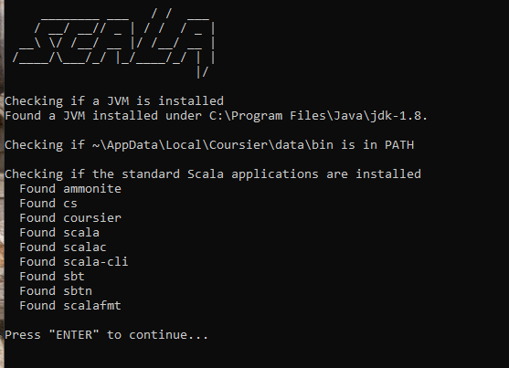
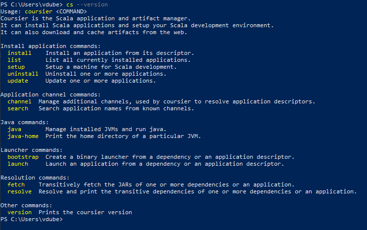

## Follow the below steps to install the scala
### 1. **Install Coursier**

If Coursier is not installed, follow these steps:
1. **Download Coursier Installer:**
2. You can download the Coursier installer for Windows from the [Coursier GitHub releases page](https://github.com/coursier/coursier/releases) or https://get-coursier.io/docs/cli-installation.html#windows
3. Extract the zip file and double click to install, CMD will open and it will install all required packages.

   

4. In my case it is already installed
5. check the cs version `cs --version`



6. Navigate the below path and add the below path into env variable.

```cmd
SCALA_HOME=C:\Users\vdube\AppData\Local\Coursier\cache\arc\https\github.com\scala\scala3\releases\download\3.5.0\scala3-3.5.0-x86_64-pc-win32.zip\scala3-3.5.0-x86_64-pc-win32

PATH=%SCALA_HOME%\bin
```

7. check the scala version `scala --version`
8. check the sbt version `sbt --version`
9. create simple project and run using below steps


--------------------------


<font color="#f79646">To create a simple Scala project using SBT, follow these steps:</font>

### 1. **Create a Simple SBT Project**

1. **Create the project directory:**
   
   Open your terminal or PowerShell, and run:
   ```bash
   mkdir simple-scala-project
   cd simple-scala-project
   ```

2. **Initialize the SBT project:**

   Inside the project directory, create a basic SBT structure by creating the following folders:
   ```bash
   mkdir -p src/main/scala
   ```

3. **Create `build.sbt` file:**

   Create a `build.sbt` file in the root of the project with the following content:
   ```scala
   name := "SimpleScalaProject"

   version := "0.1"

   scalaVersion := "2.13.12"
   ```

4. **Add a simple Scala file:**

   Inside the `src/main/scala` directory, create a file called `Main.scala`:
   ```bash
   notepad src/main/scala/Main.scala
   ```

   Add the following Scala code:
   ```scala
   object Main extends App {
     println("Hello, Scala!")
   }
   ```

### 2. **Compile and Run the Project**

To compile and run the project, follow these steps:

1. **Open a terminal or PowerShell** in the project directory (`simple-scala-project`), and run:
   ```bash
   sbt
   ```

   This will start the SBT console.

2. **Compile the project:**

   Inside the SBT console, type:
   ```bash
   compile
   ```

3. **Run the project:**

   After compilation, run:
   ```bash
   run
   ```

   You should see the output:
   ```
   Hello, Scala!
   ```

or, we can 🚀 <font color="#f79646">directly run sbt project</font> by running the `sbt run` in CMD in project folder.


### 3. **Project Structure**

Your project structure should look like this:

```scala
simple-scala-project/
├── build.sbt
└── src/
    └── main/
        └── scala/
            └── Main.scala
```

### 4. **Exit SBT**

To exit the SBT shell, simply type:
```bash
exit
```

This is how you can create and run a simple SBT project with Scala! Let me know if you'd like to add any features or expand the project further.